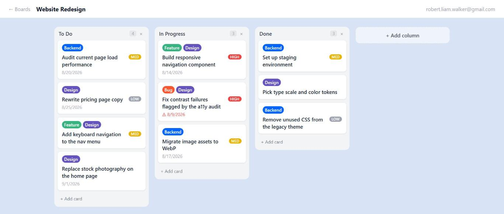
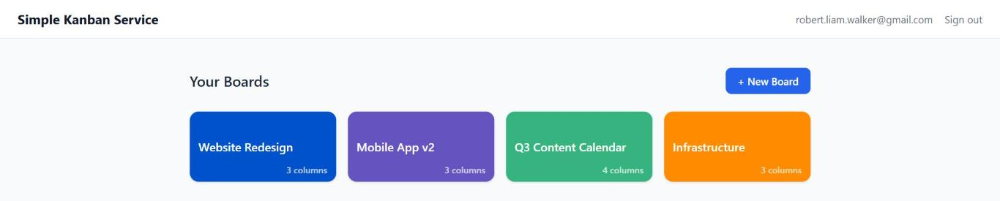
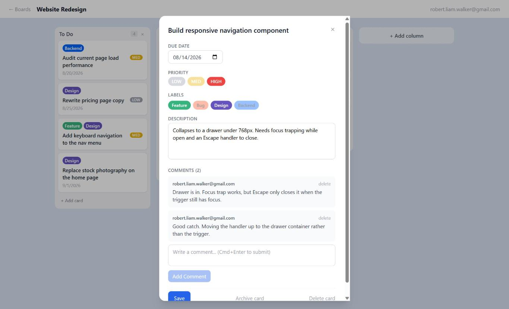

# Simple Kanban Service

A self-hosted Kanban board: boards, columns, drag-and-drop cards, labels, due dates, and comments, backed by a typed REST API.

**Live:** [simplekanbansvc.com](https://simplekanbansvc.com)



## About

Simple Kanban Service is a small, complete web application built to be run by one person on one server. It covers the whole path from schema to UI: a relational data model in Prisma/MySQL, a Fastify REST API with session auth, and a React single-page client with drag-and-drop board interactions.

The project exists as a working answer to a narrow question: what does a Trello-style tool look like when it is stripped to the parts that actually get used every day, and owned end to end rather than rented? There is no dark mode, no plugin system, and no realtime layer. What is there is fully implemented and typed, front to back.

Points of interest for anyone reading the code:

- **Ordering under drag-and-drop.** Cards and columns carry an integer `position`. The board applies a drop optimistically with `arrayMove`, then reconciles by PATCHing the positions that actually changed. It is a deliberate tradeoff: the UI never waits on the network, at the cost of a burst of writes per drop. Collapsing that into one transactional reorder endpoint is on the roadmap.
- **Cascade-first schema.** Every ownership edge (user to board to column to card, plus labels and comments) declares `onDelete: Cascade` in Prisma, so deleting a board is one statement rather than an application-level sweep.
- **Session auth, not JWT.** Server-side sessions with an httpOnly cookie and bcrypt hashes at cost 12. The `Secure` flag is gated on `COOKIE_SECURE` so the same build runs over plain HTTP in local development and over TLS in production.
- **Single-process deploy.** In production the API also serves the built client from `client/dist` and falls back to `index.html` for client-side routes, so the whole app is one Node process behind nginx.
- **Optional admin API.** `/api/admin/*` is token-guarded and returns `503` unless `ADMIN_TOKEN` is set, which lets other tools seed and move cards without a browser session.

## Features

**Boards.** Create, rename, recolor, and delete boards. New boards come with To Do / In Progress / Done. Board list renders as a grid of color tiles.



**Columns.** Add, rename inline (double-click the header), reorder by dragging, delete with cascade.

**Cards.** Create, edit, archive, delete. Drag between columns and reorder within a column (dnd-kit, with a drag overlay). Detail modal covers description, labels, priority (low/medium/high), due date, and comments. Overdue due dates highlight red.



**Labels.** Per-board labels with names and colors, toggled per card, shown as chips on card previews.

**Comments.** Threaded per card, posted with Cmd/Ctrl+Enter, deletable by their author. A card `Activity` model records moves, edits, and creations.

**Auth.** Username and password registration and login, bcrypt-hashed, session-cookie backed, with every non-auth route behind a guard.

## Stack

| Layer | Technology |
|---|---|
| Backend | Node.js + Fastify (TypeScript, ESM) |
| Frontend | React + Vite (TypeScript) |
| Database | MySQL 8 + Prisma ORM |
| Styling | Tailwind CSS |
| Drag & drop | @dnd-kit/core |
| Auth | @fastify/session + bcrypt |
| Repo layout | npm workspaces monorepo |

## Getting started

### Prerequisites

- Node.js 18+
- npm 9+
- MySQL 8+

### Database

```bash
mysql -u root -p -e "
  CREATE DATABASE simple_kanban_service;
  CREATE USER 'simple_kanban_service'@'localhost' IDENTIFIED BY 'yourpassword';
  GRANT ALL PRIVILEGES ON simple_kanban_service.* TO 'simple_kanban_service'@'localhost';
  FLUSH PRIVILEGES;"
```

### Install and run

```bash
git clone https://github.com/Robert-Liam-Walker/simple-kanban-service.git
cd simple-kanban-service
cp .env.example .env      # then fill in DATABASE_URL and SESSION_SECRET
npm install
npm run db:migrate
npm run dev
```

The client runs at `http://localhost:5173` and proxies API calls to the server at `http://localhost:3000`.

### Scripts

```bash
npm run dev          # server and client together, both in watch mode
npm run build        # production build of both workspaces
npm run start        # run the production server (also serves client/dist)
npm run db:migrate   # apply Prisma migrations
npm run db:studio    # Prisma Studio, a GUI over the database
```

## Environment variables

| Variable | Required | Purpose |
|---|---|---|
| `DATABASE_URL` | yes | MySQL connection string |
| `SESSION_SECRET` | yes | Session signing key, use a long random string |
| `PORT` | no | API port, defaults to `3000` |
| `NODE_ENV` | no | `production` enables static client serving and locks CORS |
| `COOKIE_SECURE` | no | Set to `true` when serving over HTTPS |
| `ADMIN_TOKEN` | no | Enables `/api/admin/*`, which returns `503` while unset |

See `.env.example`.

## API

All routes require an authenticated session except `/api/auth/register` and `/api/auth/login`. Admin routes use a bearer token instead.

| Method | Route | |
|---|---|---|
| POST | `/api/auth/register` | Create an account and open a session |
| POST | `/api/auth/login` | Log in |
| POST | `/api/auth/logout` | Destroy the session |
| GET | `/api/auth/me` | Current user |
| GET | `/api/boards` | List boards |
| POST | `/api/boards` | Create a board with default columns |
| GET | `/api/boards/:id` | Board with columns and cards |
| PATCH | `/api/boards/:id` | Rename or recolor |
| DELETE | `/api/boards/:id` | Delete, cascading |
| POST | `/api/boards/:boardId/columns` | Add a column |
| PATCH | `/api/columns/:id` | Rename or set position |
| DELETE | `/api/columns/:id` | Delete, cascading |
| POST | `/api/columns/:columnId/cards` | Create a card |
| GET | `/api/cards/:id` | Card detail with labels and comments |
| PATCH | `/api/cards/:id` | Update title, description, due date, priority |
| PATCH | `/api/cards/:id/move` | Move to a column and position |
| PATCH | `/api/cards/:id/archive` | Archive |
| DELETE | `/api/cards/:id` | Delete |
| GET | `/api/boards/:boardId/labels` | List board labels |
| POST | `/api/boards/:boardId/labels` | Create a label |
| DELETE | `/api/labels/:id` | Delete a label |
| POST | `/api/cards/:id/labels` | Attach a label |
| DELETE | `/api/cards/:id/labels/:labelId` | Detach a label |
| GET | `/api/cards/:cardId/comments` | List comments |
| POST | `/api/cards/:cardId/comments` | Add a comment |
| DELETE | `/api/comments/:id` | Delete your own comment |

## Project structure

```
simple-kanban-service/
  server/                  # Fastify API
    src/
      routes/              # auth, boards, columns, cards, labels, comments, admin
      middleware/auth.ts   # session guard
      lib/prisma.ts        # Prisma client singleton
    prisma/
      schema.prisma
      migrations/
  client/                  # React + Vite SPA
    src/
      pages/               # LoginPage, BoardsPage, BoardPage
      components/          # CardModal
      hooks/useAuth.ts
      api/                 # typed fetch client
  package.json             # npm workspaces root
```

## Roadmap

- One transactional reorder endpoint to replace the per-card position PATCHes
- Markdown rendering in card descriptions
- Label creation from the board UI (labels are currently created through the API)
- Activity feed in the card modal (the model records events, the UI does not show them yet)
- Archived cards view
- Toast notifications and loading skeletons
- Responsive layout for tablet

## License

MIT. See [LICENSE](LICENSE).
